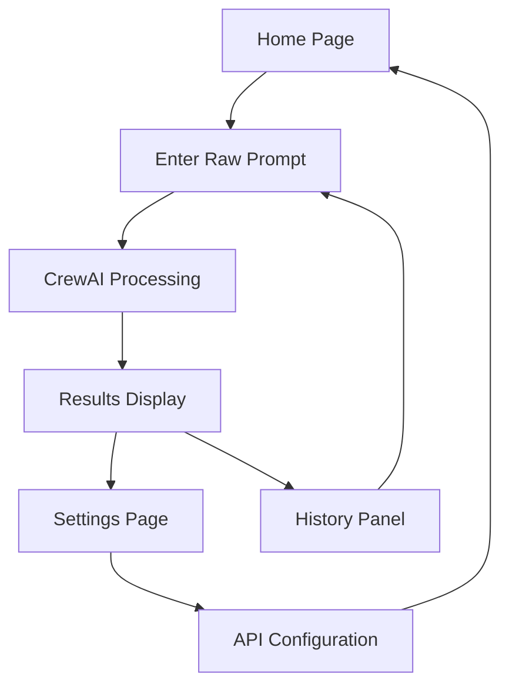

# Text-to-Image Prompt Generator - Product Requirements Document

## 1. Product Overview
A sophisticated text-to-image prompt generator that transforms vague user inputs into detailed, structured prompts optimized for AI image generation models. The application leverages CrewAI's multi-agent framework to refine prompts through collaborative AI agents, ensuring high-quality outputs with technical precision.

The product addresses the challenge of creating effective prompts for image generation by providing an intelligent system that understands artistic and technical requirements, helping users achieve better results from AI image models.

## 2. Core Features

### 2.1 User Roles
| Role | Registration Method | Core Permissions |
|------|---------------------|------------------|
| User | Direct access (no registration required) | Can generate prompts, configure API keys, adjust settings |

### 2.2 Feature Module
Our text-to-image prompt generator consists of the following main pages:
1. **Home page**: prompt input interface, generation results display, processing status.
2. **Settings page**: API key management, provider selection, NSFW toggle configuration.

### 2.3 Page Details
| Page Name | Module Name | Feature description |
|-----------|-------------|---------------------|
| Home page | Prompt Input Interface | Accept user's raw text input, validate input length and content |
| Home page | Generation Engine | Process input through CrewAI agents, display real-time processing status |
| Home page | Results Display | Show structured JSON output with camera, subjects, environment, lighting, and NSFW fields |
| Home page | History Panel | Display recent prompt generations for reference and reuse |
| Settings page | API Key Management | Store and manage API keys for OpenAI, Gemini, Grok, LM Studio providers |
| Settings page | Provider Configuration | Select active AI provider, configure model preferences |
| Settings page | Content Filters | Toggle NSFW content generation, set content safety preferences |
| Settings page | Export/Import | Backup and restore user settings and API configurations |

## 3. Core Process
The main user flow involves entering a basic prompt idea, which gets processed through three specialized AI agents working in sequence. The Initial Prompt Drafter refines the user's input, the Technical Editor adds detailed stylistic and camera elements, and the Supervising Editor performs a final review incorporating user preferences. The system outputs a structured JSON format containing camera settings, subject details, environment description, lighting specifications, and content rating.

## 4. User Interface Design
### 4.1 Design Style
- Primary colors: Deep purple (#6366f1) and electric blue (#3b82f6)
- Secondary colors: Soft gray (#f8fafc) and charcoal (#1e293b)
- Button style: Rounded corners with subtle shadows and hover animations
- Font: Inter for headings (24px, 18px), Source Sans Pro for body text (16px, 14px)
- Layout style: Card-based design with clean spacing, top navigation with sidebar for settings
- Icon style: Lucide icons with consistent stroke width, subtle animations on interaction

### 4.2 Page Design Overview
| Page Name | Module Name | UI Elements |
|-----------|-------------|-------------|
| Home page | Prompt Input Interface | Large textarea with placeholder text, character counter, submit button with loading state |
| Home page | Generation Engine | Progress indicator with agent status, real-time processing feedback |
| Home page | Results Display | Syntax-highlighted JSON viewer, copy-to-clipboard functionality, expandable sections |
| Home page | History Panel | Collapsible sidebar with recent generations, search and filter options |
| Settings page | API Key Management | Secure input fields with show/hide toggle, provider logos, connection status indicators |
| Settings page | Provider Configuration | Radio buttons for provider selection, dropdown for model options |
| Settings page | Content Filters | Toggle switches with clear labels, warning indicators for NSFW content |

### 4.3 Responsiveness
Desktop-first design with mobile-adaptive layout. Touch interaction optimization for mobile devices, with larger touch targets and swipe gestures for navigation.