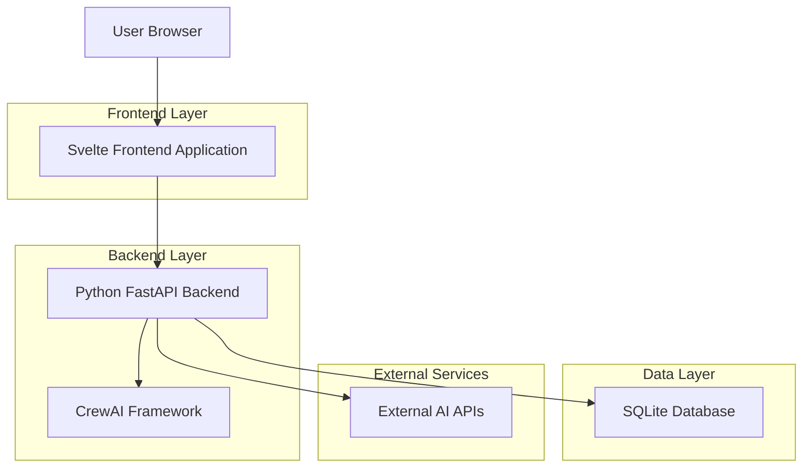
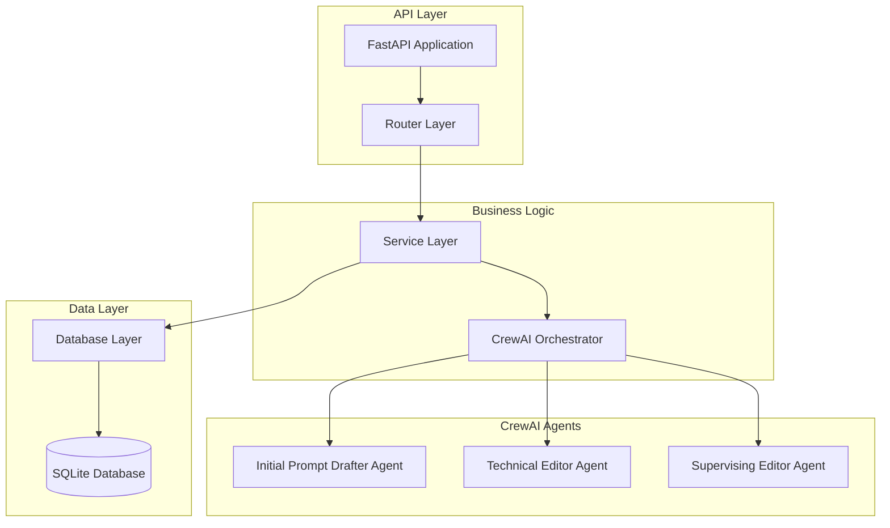
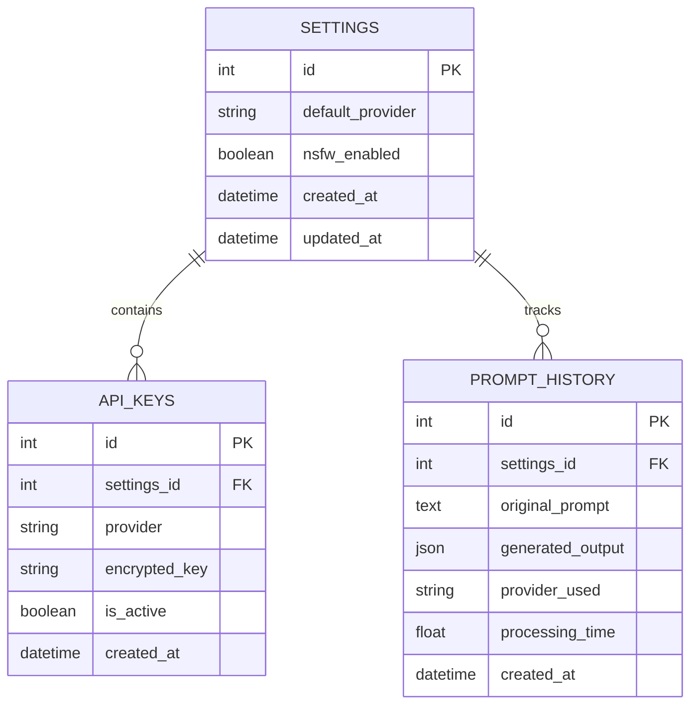

# Text-to-Image Prompt Generator - Technical Architecture Document

## 1. Architecture Design



## 2. Technology Description
- Frontend: Svelte@4 + SvelteKit + TailwindCSS@3 + Vite
- Backend: Python@3.11 + FastAPI@0.104 + CrewAI@0.28 + SQLAlchemy@2.0
- Database: SQLite (for development and lightweight deployment)
- External APIs: OpenAI, Google Gemini, Grok, LM Studio

## 3. Route Definitions
| Route | Purpose |
|-------|---------|
| / | Home page, main prompt generation interface |
| /settings | Settings page, API key and configuration management |
| /api/generate | API endpoint for prompt generation |
| /api/settings | API endpoint for settings management |
| /api/history | API endpoint for prompt history |

## 4. API Definitions

### 4.1 Core API

Prompt generation endpoint
```
POST /api/generate
```

Request:
| Param Name | Param Type | isRequired | Description |
|------------|------------|------------|-------------|
| prompt | string | true | Raw user input prompt |
| provider | string | false | AI provider preference (openai, gemini, grok, lmstudio) |
| nsfw_enabled | boolean | false | Allow NSFW content generation |

Response:
| Param Name | Param Type | Description |
|------------|------------|-------------|
| success | boolean | Generation status |
| data | object | Structured prompt output |
| processing_time | number | Time taken in seconds |

Example Request:
```json
{
  "prompt": "a woman in a garden",
  "provider": "openai",
  "nsfw_enabled": false
}
```

Example Response:
```json
{
  "success": true,
  "data": {
    "camera": {
      "angle": "eye level",
      "lens": "85mm portrait lens",
      "framing": "medium shot"
    },
    "subjects": [{
      "mood": "serene and contemplative",
      "body_attributes": "elegant posture, graceful hands",
      "age": 30,
      "wardrobe": "flowing summer dress in soft pastels",
      "pose": "standing among flowers, gentle smile"
    }],
    "environment": "lush botanical garden with blooming flowers and dappled sunlight",
    "lighting": "soft natural lighting, golden hour, warm color temperature",
    "nsfw": false
  },
  "processing_time": 12.5
}
```

Settings management endpoint
```
POST /api/settings
```

Request:
| Param Name | Param Type | isRequired | Description |
|------------|------------|------------|-------------|
| provider | string | false | Default AI provider |
| api_keys | object | false | API keys for different providers |
| nsfw_default | boolean | false | Default NSFW setting |

Response:
| Param Name | Param Type | Description |
|------------|------------|-------------|
| success | boolean | Update status |
| message | string | Status message |

## 5. Server Architecture Diagram



## 6. Data Model

### 6.1 Data Model Definition



### 6.2 Data Definition Language

Settings Table (settings)
```sql
-- Create settings table
CREATE TABLE settings (
    id INTEGER PRIMARY KEY AUTOINCREMENT,
    default_provider VARCHAR(50) DEFAULT 'openai',
    nsfw_enabled BOOLEAN DEFAULT FALSE,
    created_at TIMESTAMP DEFAULT CURRENT_TIMESTAMP,
    updated_at TIMESTAMP DEFAULT CURRENT_TIMESTAMP
);

-- Create API keys table
CREATE TABLE api_keys (
    id INTEGER PRIMARY KEY AUTOINCREMENT,
    settings_id INTEGER,
    provider VARCHAR(50) NOT NULL,
    encrypted_key TEXT NOT NULL,
    is_active BOOLEAN DEFAULT TRUE,
    created_at TIMESTAMP DEFAULT CURRENT_TIMESTAMP,
    FOREIGN KEY (settings_id) REFERENCES settings(id)
);

-- Create prompt history table
CREATE TABLE prompt_history (
    id INTEGER PRIMARY KEY AUTOINCREMENT,
    settings_id INTEGER,
    original_prompt TEXT NOT NULL,
    generated_output JSON NOT NULL,
    provider_used VARCHAR(50),
    processing_time REAL,
    created_at TIMESTAMP DEFAULT CURRENT_TIMESTAMP,
    FOREIGN KEY (settings_id) REFERENCES settings(id)
);

-- Create indexes
CREATE INDEX idx_api_keys_provider ON api_keys(provider);
CREATE INDEX idx_prompt_history_created_at ON prompt_history(created_at DESC);
CREATE INDEX idx_prompt_history_provider ON prompt_history(provider_used);

-- Insert default settings
INSERT INTO settings (default_provider, nsfw_enabled) VALUES ('openai', FALSE);
